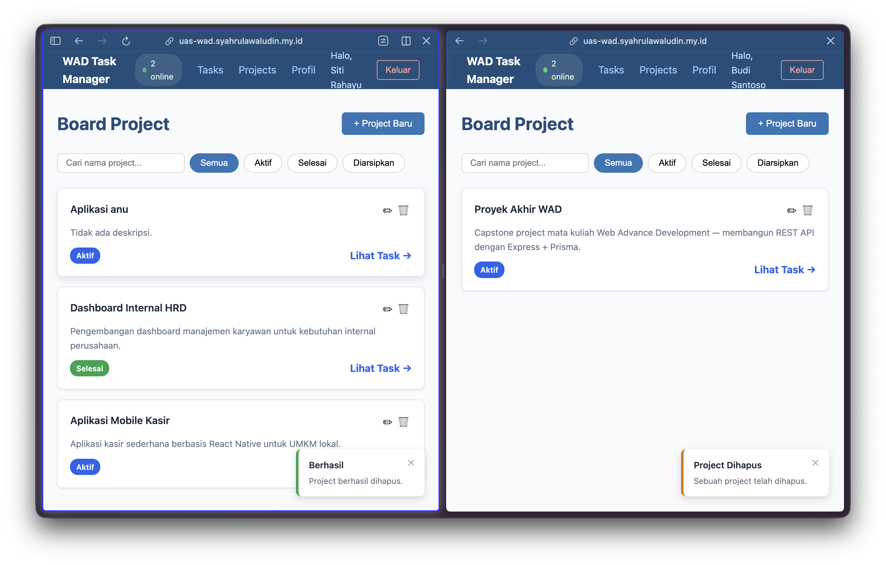
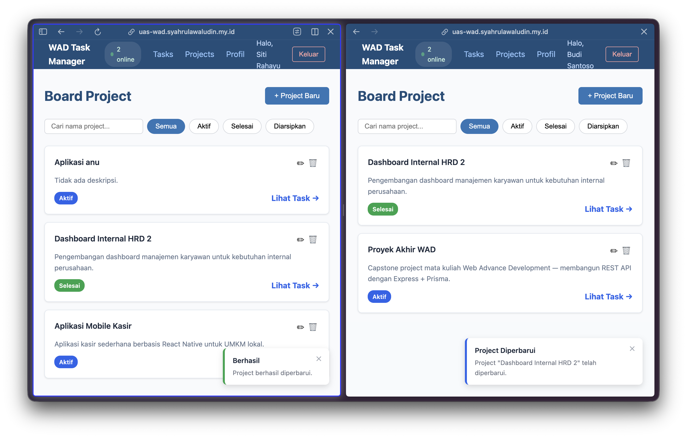
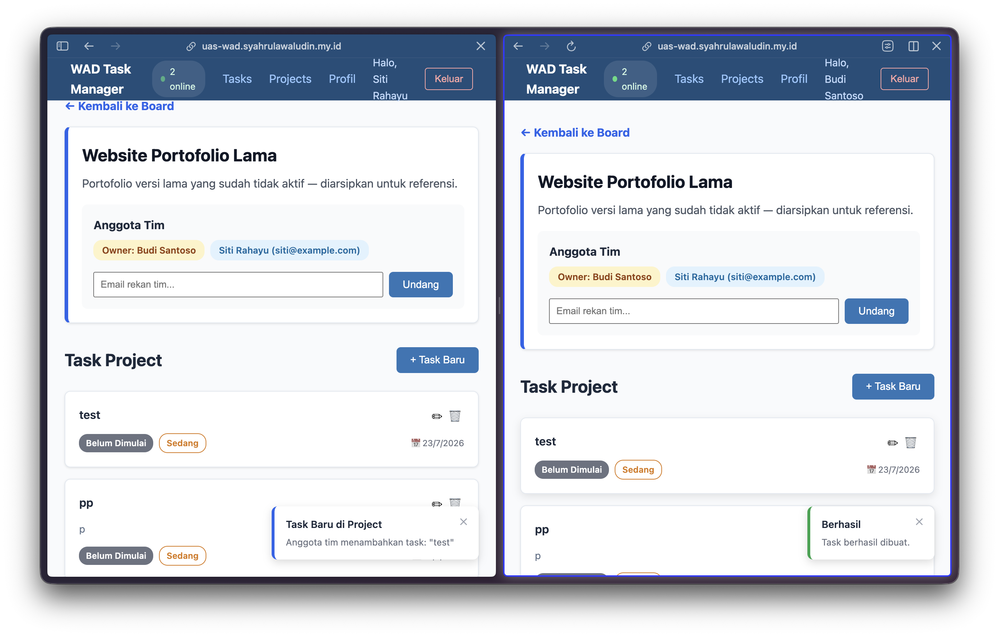
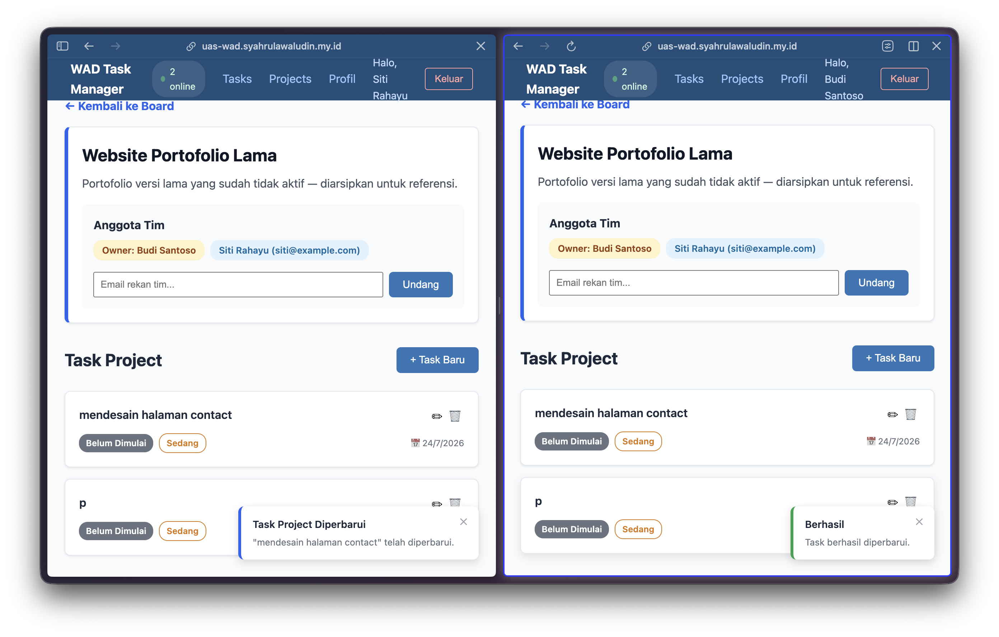
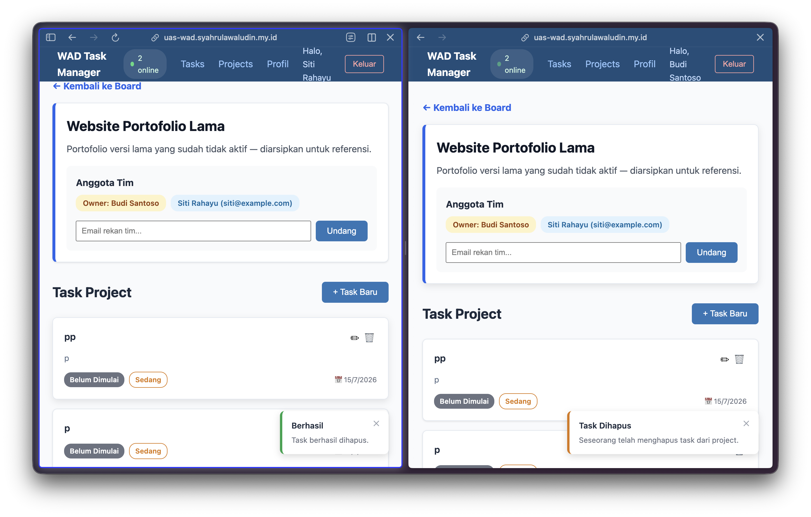
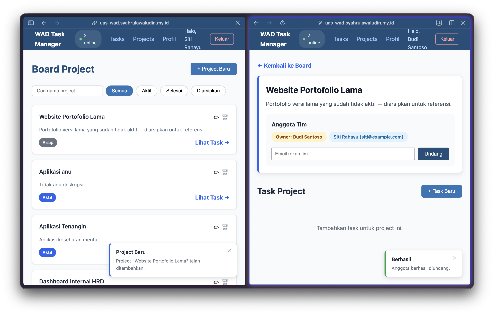

# WAD Capstone - Frontend

> 🌐 **Live Production:** [https://uas-wad.syahrulawaludin.my.id](https://uas-wad.syahrulawaludin.my.id)

Repositori ini berisi *source code* untuk antarmuka pengguna (Frontend) dari aplikasi **WAD Task Manager**, yang dikembangkan untuk memenuhi tugas akhir (UAS) mata kuliah Web Application Development.

## 🚀 Teknologi yang Digunakan
- **React.js**: Library JavaScript untuk membangun antarmuka pengguna yang dinamis.
- **Vite**: *Build tool* modern yang sangat cepat untuk *scaffolding* dan pengembangan lokal.
- **Tailwind CSS & DaisyUI**: Framework CSS *utility-first* beserta komponen UI *pre-built* untuk desain yang responsif dan elegan (Dark Mode didukung penuh).
- **Socket.IO-Client**: Digunakan untuk menangkap *event* secara *real-time* (WebSockets) agar halaman terbarui secara otomatis saat ada kolaborasi tim.
- **Axios**: HTTP Client untuk melakukan *request* ke REST API Backend.

## 🏗️ Arsitektur Proyek (React Hooks Pattern)
Aplikasi ini menstrukturkan kodenya berdasarkan *Clean Architecture* gaya React (pemisahan *View* dan *Logic*):
- **`src/pages/`**: Komponen utama pembentuk halaman (UI).
- **`src/hooks/`**: *Custom Hooks* (seperti `useTasks`, `useProjects`) yang memisahkan logika pengambilan data (Fetching) dan *State Management* dari antarmuka pengguna.
- **`src/services/`**: Pembungkus Axios untuk memanggil *endpoint* API (isolasi logika jaringan).
- **`src/contexts/`**: *React Context* untuk menyediakan *State* secara global (seperti `AuthContext` untuk sesi pengguna dan `SocketContext` untuk koneksi WebSocket).
- **`src/components/`**: Komponen UI kecil yang dapat digunakan kembali (*reusable*).

---

## 📦 Panduan Setup Lokal

1. Pastikan **Node.js** terinstal di mesin Anda.
2. Pastikan **Backend WAD Capstone** sudah berjalan secara lokal (biasanya di port `5001`).
3. *Clone* repositori ini dan masuk ke direktori `wad-frontend`.
4. Install semua dependensi NPM:
   ```bash
   npm install
   ```
5. Buat file `.env` di *root* direktori dan atur URL API Backend:
   ```env
   VITE_API_URL=http://localhost:5001/api/v1
   ```
   *(Catatan: URL secara bawaan adalah localhost, ganti dengan URL VPS jika ingin menembak ke server langsung).*
6. Jalankan mode *development*:
   ```bash
   npm run dev
   ```
7. Buka browser dan akses `http://localhost:5002` (atau *port* yang diberikan Vite di terminal).

---

## 🌐 Integrasi Real-Time (Socket.IO)
Aplikasi Frontend ini terhubung penuh secara _real-time_ dengan Backend menggunakan pola _Context API_. 
- Setiap kali Anda melakukan perubahan Tugas atau Proyek, perubahan tersebut dipantulkan ke semua rekan tim yang membuka Proyek yang sama, memicu _Custom Hooks_ untuk otomatis mengambil ulang (Re-fetch) data tanpa memuat ulang halaman (*Auto-update UI*).
- Jumlah pengguna *online* dan *offline* direkam secara seketika (*live*).

---
*Dikembangkan untuk Tugas Akhir (UAS) Web Application Development.*

---

## 📸 Dokumentasi Fitur Real-Time

Aplikasi ini mendukung kolaborasi secara *real-time* di mana setiap aktivitas langsung disinkronisasi ke layar pengguna lain dalam satu tim berkat integrasi **Socket.IO**.

### Sinkronisasi Penghapusan Proyek (Real-Time)
Ketika *owner* menghapus proyek, proyek tersebut akan langsung hilang dari layar "Board Project" seluruh anggota tim lainnya beserta munculnya notifikasi *toast* secara *real-time*.


### Sinkronisasi Pembaruan Proyek (Real-Time)
Setiap perubahan informasi proyek akan langsung diperbarui di layar pengguna lain tanpa me-*refresh* halaman.


### Sinkronisasi Penambahan Task (Real-Time)
Tampilan seketika antar pengguna ketika salah satu anggota tim membuat *task* baru.


### Sinkronisasi Pembaruan Task (Real-Time)
Perubahan status atau detail *task* akan langsung ter-*update* pada layar kolaborator.


### Sinkronisasi Penghapusan Task (Real-Time)
Apabila ada anggota tim yang menghapus *task*, daftar *task* di layar anggota lain akan ikut terhapus.


### Sinkronisasi Penugasan Anggota
Menampilkan interaksi saat anggota ditugaskan atau diundang.

