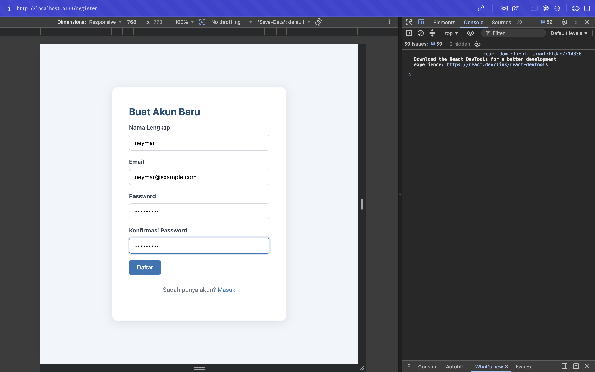

# WAD Task Manager - Frontend

Aplikasi frontend (Client-side) untuk mengelola daftar pekerjaan (Task Manager). Proyek ini dibangun menggunakan **React (Vite)** dan terhubung dengan RESTful API dari backend untuk mengelola autentikasi dan data tugas-tugas.

## 🚀 Teknologi yang Digunakan

- **React 19**
- **Vite** (Build Tool & Dev Server)
- **React Router DOM** (Routing halaman)
- **Axios** (HTTP Client, pengaturan *Interceptors* untuk token)
- **React Hook Form** (Manajemen state form dan validasi)

## ✨ Fitur Utama

1. **Autentikasi (Auth)**
   - Login & Register
   - JWT Access Token & Refresh Token terintegrasi secara otomatis via Axios Interceptors.
   - Proteksi Rute (Halaman login tidak bisa diakses jika sudah masuk, halaman tasks tidak bisa diakses jika belum masuk).
2. **Manajemen Task (CRUD)**
   - Melihat daftar task milik pengguna.
   - Menambah task baru.
   - Mengedit (update) data task seperti judul, deskripsi, status, prioritas, dan tenggat waktu.
   - Menghapus task.
3. **Filter & Navigasi**
   - Filter task berdasarkan status (`TODO`, `IN_PROGRESS`, `DONE`).

## ⚙️ Prasyarat (Prerequisites)

Sebelum menjalankan aplikasi ini, pastikan Anda telah menginstal:
- [Node.js](https://nodejs.org/en/) (Versi 18+ direkomendasikan)
- [npm](https://www.npmjs.com/) (Biasanya sudah terpasang bersama Node.js)
- Server Backend berjalan di lokal (menggunakan port `3000`).

## 🛠 Instalasi dan Menjalankan Proyek

1. **Clone repositori atau masuk ke direktori proyek:**
   ```bash
   cd wad-frontend
   ```

2. **Instal seluruh dependensi:**
   ```bash
   npm install
   ```

3. **Menjalankan Development Server:**
   ```bash
   npm run dev
   ```
   Aplikasi akan berjalan di `http://localhost:5173/`. Vite secara otomatis mem-proxy request yang diawali dengan `/api` ke server backend Anda (localhost:3000).

## 📁 Struktur Folder Utama

```
src/
├── components/     # Komponen UI yang digunakan berulang (Navbar, TaskCard, TaskForm, ProtectedRoute)
├── contexts/       # React Context API (AuthContext untuk global state Autentikasi)
├── lib/            # Konfigurasi library pihak ketiga (Instansiasi Axios & Interceptor)
├── pages/          # Komponen halaman (LoginPage, RegisterPage, TasksPage)
├── services/       # Service untuk memanggil endpoint API (auth.service, task.service)
├── App.jsx         # Root component & Konfigurasi routing
├── index.css       # Styling aplikasi
└── main.jsx        # Entry point aplikasi React
```

## 🔐 Konfigurasi Proxy (Vite)

Pada file `vite.config.js`, proyek ini telah diatur untuk menggunakan proxy ke backend guna menghindari masalah CORS selama pengembangan:

```javascript
export default defineConfig({
  plugins: [react()],
  server: {
    proxy: {
      '/api': {
        target: 'http://localhost:3000',
        changeOrigin: true,
      }
    }
  }
})
```
Pastikan backend Express berjalan di `http://localhost:3000`.

## 🎨 Tampilan UI / Styling
Proyek ini menggunakan standard Vanilla CSS (di dalam `index.css`) untuk menyusun layout dan desain visual tanpa ketergantungan pada *framework CSS* pihak ketiga. 

---

## 🧪 Panduan Pengetesan (Manual / UAT)

Aplikasi ini dapat diuji secara *End-to-End* (E2E) melalui browser untuk memvalidasi alur kerja pengguna secara keseluruhan. Berikut adalah skenario pengujiannya:

### 1. Pendaftaran & Autentikasi (Register / Login)
- Buka `http://localhost:5173/register`.
- Masukkan informasi pendaftaran (contoh: Nama `neymar`, Email `neymar@example.com`, dan password Anda).
- Setelah berhasil, login dengan kredensial tersebut di halaman `/login`.



### 2. State Kosong (Empty State) & Profil
- Jika ini adalah akun baru, halaman `Tasks` akan menampilkan layar bersih dengan pesan *"Belum ada task. Buat task pertamamu!"*.
- Anda dapat menekan menu **Profil** di bilah navigasi (Navbar) atas untuk melihat detail akun yang sedang masuk.


### 3. Pembuatan & Pembaruan (Create & Edit Task)
- **Create**: Klik tombol **+ Task Baru**. Isi formulir judul (contoh: *"Belajar dribble seperti Messi"*), deskripsi, status, dan prioritas, lalu simpan.
- **Edit**: Pada *Task Card* yang muncul, klik *icon* pensil ✏️. Anda dapat mengubah statusnya (misal menjadi *"Sedang Dikerjakan"*).


### 4. Menghapus Task (Delete) & Logout
- **Delete**: Klik *icon* tempat sampah 🗑️ pada *Task Card*. Sebuah konfirmasi *pop-up* akan muncul. Pilih **OK**, maka data task akan dihapus permanen.
- **Logout**: Klik tombol **Keluar** di pojok kanan atas.


